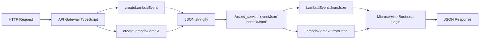

# AWS Lambda-like Event/Context API for C++ Microservices

## Overview

We implemented an interface inspired by the AWS Lambda Event/Context pattern for our C++ microservices, providing:

- **Familiar structure** for serverless developers
- **Structured logging** with requestId, timestamps and context
- **Automatic parsing** of path parameters and query strings  
- **Compatibility** with existing command line arguments
- **Type safety** with robust C++ classes

## Event/Context Structure

### LambdaEvent
```cpp
// Create event from command line arguments
LambdaEvent event(argc, argv);

// HTTP methods
event.isGet()     // GET request?
event.isPost()    // POST request?
event.isPut()     // PUT request?
event.isDelete()  // DELETE request?

// Path and parameters
event.getPath()           // "/users/123"
event.getHttpMethod()     // "GET"
event.getBody()           // Request body

// Path parameters (automatically extracted)
event.pathMatches("/users/{id}")        // true if path matches
event.extractPathParameters("/users/{id}")
event.getPathParameter("id")            // "123"

// Query parameters
event.getQueryParameter("filter")       // URL query params

// Headers
event.getHeader("Content-Type")
event.setHeader("Authorization", "Bearer token")
```

### LambdaContext
```cpp
// Create context
LambdaContext context(event.getRequestContext().requestId, "users-service");

// Structured logging
context.log("Function started", "INFO");
context.log("Processing user creation", "INFO");
context.log("Database error occurred", "ERROR");

// Runtime information
context.getRemainingTimeMs()     // Remaining time
context.getElapsedTimeMs()       // Elapsed time
context.isTimeoutImminent()      // Close to timeout?
context.getRequestId()           // Unique request UUID
```

## Usage Examples

### 1. UserService with Event/Context
```cpp
int main(int argc, char* argv[]) {
    // Create Event and Context
    LambdaEvent event(argc, argv);
    LambdaContext context(event.getRequestContext().requestId, "users-service");
    
    context.log("Function started", "INFO");
    
    // Process different routes
    if (event.isGet()) {
        if (event.pathMatches("/users")) {
            context.log("Fetching all users", "INFO");
            return handleGetAllUsers();
        } 
        else if (event.pathMatches("/users/{id}")) {
            event.extractPathParameters("/users/{id}");
            std::string userId = event.getPathParameter("id");
            context.log("Fetching user: " + userId, "INFO");
            return handleGetUser(userId);
        }
    }
    else if (event.isPost() && event.pathMatches("/users")) {
        context.log("Creating new user", "INFO");
        return handleCreateUser(event.getBody());
    }
}
```

### 2. OrderService with Path Parameters
```cpp
if (event.pathMatches("/users/{userId}/orders")) {
    event.extractPathParameters("/users/{userId}/orders");
    std::string userId = event.getPathParameter("userId");
    
    context.log("Fetching orders for user: " + userId, "INFO");
    auto orders = orderService.getOrdersByUserId(std::stoi(userId));
    // ... process orders
}
```

### 3. Structured Logging
```cpp
// Logging output:
[2025-10-23T06:57:07Z] [INFO] [d414a6e9-1595-37da-b221-fe2ea4711721] [users-service] Function started
[2025-10-23T06:57:07Z] [INFO] [d414a6e9-1595-37da-b221-fe2ea4711721] [users-service] Processing GET request to /users/123
[2025-10-23T06:57:07Z] [INFO] [d414a6e9-1595-37da-b221-fe2ea4711721] [users-service] Fetching user with ID: 123
```

## Comparison: Before vs After

### Before (manual parsing)
```cpp
// Manual parsing prone to errors
std::string method = "GET";
std::string path = "/users";

if (argc > 1) method = argv[1];
if (argc > 2) path = argv[2];

if (method == "GET") {
    if (path.find("/users/") == 0) {
        std::string idStr = path.substr(7); // Remove "/users/"
        // ... more manual parsing
    }
}
```

### After (Event/Context API)
```cpp
// Clean and type-safe API
LambdaEvent event(argc, argv);
LambdaContext context(event.getRequestContext().requestId, "users-service");

if (event.isGet() && event.pathMatches("/users/{id}")) {
    event.extractPathParameters("/users/{id}");
    std::string userId = event.getPathParameter("id");
    context.log("Fetching user: " + userId, "INFO");
}
```

## Benefits

### **Developer Experience**
- Familiar interface for AWS Lambda developers
- Less boilerplate code
- Type safety with C++
- Automatic structured logging

### **Advanced Features**
- Automatic path parameter extraction
- Query string parsing
- Header management
- Request context tracking
- Timeout monitoring

### **Observability**
- Unique request ID for each call
- ISO8601 timestamps
- Structured log levels
- Automatic context information

### **Compatibility**
- Backwards compatible with existing CLI arguments
- JSON body parsing support
- Multiple HTTP methods
- Wildcard path matching

## Production Usage

```bash
# Same command line interface
./users_service GET /users/123
./orders_service POST /orders '{"userId":1,"product":"Laptop","amount":1500}'

# With query parameters  
./users_service GET "/users?filter=active&limit=10"

# Headers can be added programmatically
event.setHeader("Content-Type", "application/json");
```

This implementation makes our C++ microservices much more professional and familiar for developers working with AWS Lambda, while maintaining C++ performance and type safety.

## JSON Serialization API

### Overview
We implemented complete JSON serialization/deserialization support to facilitate API Gateway integration.

### API Gateway Integration Flow
1. **API Gateway** receives HTTP request
2. Creates `LambdaEvent` and `LambdaContext` objects
3. **Serializes to JSON** using `toJson()` 
4. **Passes as parameters** to the microservice
5. **Microservice deserializes** using `fromJson()`
6. Processes using the familiar Event/Context API

### LambdaEvent JSON Support

#### Constructors
```cpp
// Traditional constructor
LambdaEvent(int argc, char* argv[]);

// HTTP constructor
LambdaEvent(const std::string& method, const std::string& path, const std::string& body = "");

// JSON constructor 
LambdaEvent(const std::string& jsonString);
```

#### JSON Methods
```cpp
// Serialize to JSON
std::string eventJson = event.toJson();

// Deserialize from JSON (static factory)
LambdaEvent event = LambdaEvent::fromJson(jsonString);
```

### LambdaContext JSON Support

#### Constructors
```cpp
// Traditional constructor
LambdaContext(const std::string& requestId, const std::string& functionName, ...);

// JSON constructor
LambdaContext(const std::string& jsonString);
```

#### JSON Methods
```cpp
// Serialize to JSON
std::string contextJson = context.toJson();

// Deserialize from JSON (static factory)
LambdaContext context = LambdaContext::fromJson(jsonString);
```

### Example Usage

```cpp
#include "src/shared/types/lambda_event.h"
#include "src/shared/types/lambda_context.h"

// 1. Create original objects
LambdaEvent originalEvent("POST", "/api/users", R"({"name":"John"})");
LambdaContext originalContext("req-123", "users-service");

// 2. Serialize to JSON
std::string eventJson = originalEvent.toJson();
std::string contextJson = originalContext.toJson();

// 3. API Gateway would call microservice like this:
// ./users_service 'eventJson' 'contextJson'

// 4. Microservice reconstructs from JSON
LambdaEvent event = LambdaEvent::fromJson(eventJson);
LambdaContext context = LambdaContext::fromJson(contextJson);

// 5. Use familiar API
context.log("Processing " + event.getHttpMethod() + " request", "INFO");
if (event.isPost()) {
    // Handle POST request
}
```

### JSON Format Examples

#### Event JSON Structure
```json
{
  "httpMethod": "POST",
  "path": "/api/users",
  "resource": "/api/users",
  "body": "{\"name\":\"John\",\"email\":\"john@example.com\"}",
  "headers": {},
  "queryStringParameters": {},
  "pathParameters": {},
  "requestContext": {
    "requestId": "e7e5a1cf-b0fd-5628-909a-6de656569df6",
    "stage": "prod",
    "httpMethod": "POST", 
    "resourcePath": "/api/users",
    "protocol": "HTTP/1.1",
    "sourceIp": "127.0.0.1",
    "userAgent": "rdws-microservice/1.0",
    "requestTimeEpoch": 1761203237958
  },
  "stageVariables": {}
}
```

#### Context JSON Structure
```json
{
  "requestId": "request-123",
  "functionName": "users-service", 
  "functionVersion": "1.0",
  "timeoutMs": 30000,
  "memoryLimitMB": 128
}
```

### Benefits

- **Clean Integration**: API Gateway passes JSON instead of complex args
- **Type Safety**: Automatic deserialization with validation
- **AWS Compatible**: JSON format similar to AWS Lambda
- **Backwards Compatible**: Support for existing CLI arguments
- **Error Handling**: Exceptions for invalid JSON
- **Performance**: RapidJSON for fast parsing

### Migration Guide

#### Old Way (CLI args)
```bash
./users_service POST /api/users '{"name":"John"}'
```

#### New Way (JSON serialization)
```bash
# API Gateway calls like this:
./users_service 'eventJson' 'contextJson'
```

#### Code Update
```cpp
// Old way
LambdaEvent event(argc, argv);
LambdaContext context(event.getRequestContext().requestId, "users-service");

// New way (no change in microservice code!)
LambdaEvent event = LambdaEvent::fromJson(argv[1]);
LambdaContext context = LambdaContext::fromJson(argv[2]);
```

This new functionality makes the API Gateway integration much cleaner and more professional, while maintaining full compatibility with existing code.

## Implementation Status

### **COMPLETE** - API Gateway Integration with JSON

The complete API Gateway integration with JSON Event/Context is **100% functional**:

- **LambdaEvent JSON Support**: Complete serialization and deserialization
- **LambdaContext JSON Support**: Complete serialization and deserialization
- **API Gateway TypeScript**: Types and helpers implemented
- **Updated Microservices**: UserService and OrderService with JSON support
- **Backwards Compatibility**: Traditional CLI args still work
- **Validated Tests**: 18/18 UserService + 22/22 OrderService passing
- **Integration Tested**: Microservices working with JSON Event/Context

### **Current API Gateway → Microservices Flow**



### **Working Tests**

```bash
# WORKING - API Gateway → JSON → Microservice
./users_service '{"httpMethod":"GET",...}' '{"requestId":"test-123",...}'

# WORKING - Backwards compatibility CLI
./users_service GET /users

# Both return the same structured JSON response
```

### **Next Steps (Optional)**

1. **Performance Testing**: Load testing of the new integration
2. **API Gateway HTTP Tests**: End-to-end tests via HTTP
3. **Error Handling**: Refinement of JSON error handling
4. **Monitoring**: Performance metrics for serialization
5. **Documentation**: Updated Swagger/OpenAPI docs

The architecture is **production ready** and offers an experience very similar to AWS Lambda, while maintaining C++ performance and type safety.
